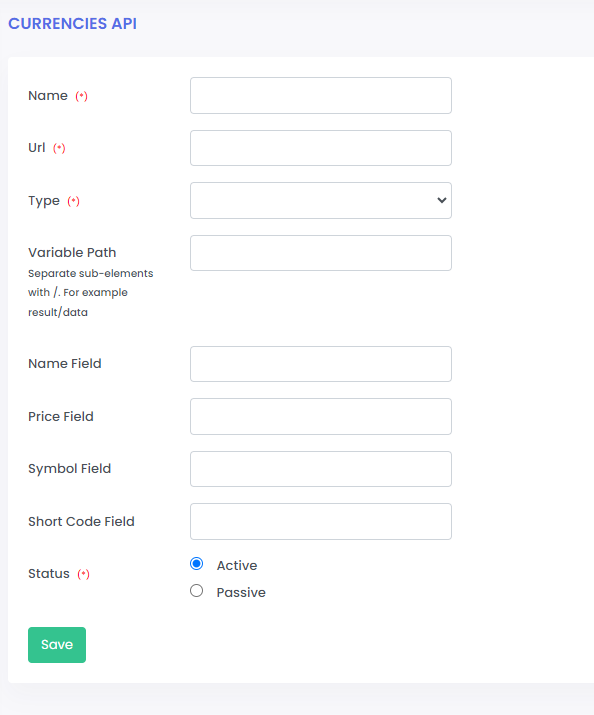

# studyCase
## Proje Açıklaması
2 ayrı kur bilgisi veren API'lerden (aşağıda mock server yanıtlarını bulabilirsin) EUR/USD/GBP kur bilgilerini alarak karşılaştırıp daha ucuz olanını ekrana basacak bir web uygulama geliştirilecek.

Burada kur bilgisi veren şirketler Adapter Patterni ile geliştirilecek ki 3. bir kur bilgisi veren API'nin (provider 3) de eklemesi  sadece API tanıtımı ile oluşsun. Uygulamanın başka yerinde herhangi bir değişikliğe ihtiyaç duymadan bu 3 kur bilgisi veren API'den en ucuzunu ana sayfada göstersin.

Bu verileri APIlerden çekmek için command (console) yazılacak ve veritabanına kaydedecek. Anasayfada veritabanından okuyarak verileri gösterecek. İhtiyaç halinde önyüzde Bootstrap ve Jquery kullanılabilir.

## Proje Kurulumu

İlk olarak composer kurulmalı.

```
composer install
```
Ana dizinde bulunan studycase.sql dosyası veri tabanına kaydedilmeli.

```
DB_CONNECTION=mysql
DB_HOST=127.0.0.1
DB_PORT=3306
DB_DATABASE=studycase
DB_USERNAME=root
DB_PASSWORD=
```

## Projede Yapılanlar

Admin panel üzerinden giriş yapılarak api servisleri eklenir.<br>
Api servisleri json ve xml formatlarında olabilir.<br>
Apiler aşağıdaki gibi tanımlanır.



Name: Servis için tanımlanan isim<br>
Url: Servis Url'i<br>
Type: Servis türü Xml ya da Json seçilebilir <br>
Variable Path: Servisten dönen cevap üzerinde, verilerin hangi katmanda olduğunu belirler.<br>
Name Field: kur verilerindeki kurun hangi field ile tanımlı olduğu anlamına gelir<br>
Price Field: kur verilerindeki kur fiyatının hangi field ile tanımlı olduğu anlamına gelir<br>
Symbol Field: kur verilerindeki kurun sembolü hangi field ile tanımlı olduğu anlamına gelir<br>
Shor Code Field: kur verilerindeki kurun kısa kodunun hangi field ile tanımlı olduğu anlamına gelir<br>

Tanımlamalar yapıldıktan sonra aktif olan servisler üzerinden <b>Command</b> çalıştırılabilir.<br>

```
php artisan currency:fetch min
php artisan currency:fetch max
``` 

Command lar ile hem min değerler yakalanabilir hem de max değerler yakalanıp. currencies modelinde tutulabilir. Her seferinde sadece min ya da max değerler tutulur.

Commandlar her çalıştığında currencies_logs modelinde ayrıca veriler tutuluyor. Bunları da admin panelde görebilirsiniz.


### Admin Kullanıcısı
Url: /admin
```
email: info@etiya.com
password: Etiya2024.,
```

## Örnek Servisler

API1 : https://run.mocky.io/v3/e5056fe0-be6f-48ba-8b51-52ff28f54372

RESPONSE
```
{
  "result": {
    "0": {
      "name": "dolar",
      "price": "32.15",
      "symbol": "$",
      "shortCode": "USD"
    },
    "1": {
      "name": "euro",
      "price": "35.17",
      "symbol": "€",
      "shortCode": "EUR"
    },
    "2": {
      "name": "sterlin",
      "price": "40.07",
      "symbol": "£",
      "shortCode": "GBP"
    }
  }
}
```

API2 : https://run.mocky.io/v3/7698a8d8-ec93-4df2-9181-ff0504078f81

RESPONSE
```
{
  "result": {
    "0": {
      "fullname": "dolar",
      "amount": "32.32",
      "symbol": "$",
      "code": "USD"
    },
    "1": {
      "fullname": "sterlin",
      "amount": "40.08",
      "symbol": "£",
      "code": "GBP"
    },
    "2": {
      "fullname": "euro",
      "amount": "35.09",
      "symbol": "€",
      "code": "EUR"
    }
  }
}
```

API3 : https://run.mocky.io/v3/c3aaf003-8958-4cfc-8809-a5aad52d0e66

RESPONSE
```
<?xml version="1.0" encoding="UTF-8"?>
<response>
  <status>success</status>
  <message>Data retrieved successfully</message>
  <result>
    <data>
      <item>
        <name>dolar</name>
        <price>30.00</price>
        <symbol>$</symbol>
        <shortCode>USD</shortCode>
      </item>
      <item>
        <name>euro</name>
        <price>31.00</price>
        <symbol>€</symbol>
        <shortCode>EUR</shortCode>
      </item>
      <item>
        <name>sterlin</name>
        <price>32.00</price>
        <symbol>£</symbol>
        <shortCode>GBP</shortCode>
      </item>
    </data>
  </result>
</response>

```
